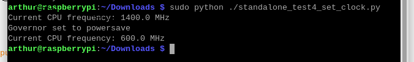
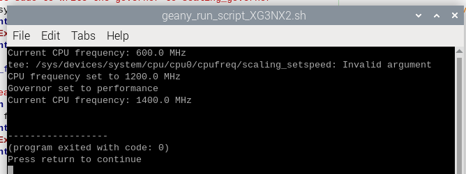

# Adjusting CPU clock on RPI for managing performance and power consumption

## 1. **Adjusting CPU Clock Through Command Line**

1. **Check Current CPU Frequency** <br> use `cat /sys/devices/system/cpu/cpu0/cpufreq/scaling_cur_freq
` <br>
   The output will be in kHz (e.g., `1400000` = 1.4 GHz).

2. **Check Available Frequencies**.<br> Use `cat /sys/devices/system/cpu/cpu0/cpufreq/scaling_available_frequencies`
   <br>This lists all supported frequencies, e.g., `600000 1200000 1400000` (600 MHz, 1.2 GHz, 1.4 GHz).

3. **Check Current Governor**. <br>
   Use `cat /sys/devices/system/cpu/cpu0/cpufreq/scaling_governor`
   <br>Governors control how the CPU adjusts its frequency dynamically.
   <br>

   - **`performance`**: Runs at the **maximum** frequency.
   - **`powersave`**: Runs at the **minimum** frequency.
   - **`ondemand`**: Dynamically adjusts based on CPU load.

4. **Set a Specific CPU Frequency.** <br>Example (set to 1.2 GHz):
   <br> Usage:`sudo sh -c "echo <frequency_in_kHz> > /sys/devices/system/cpu/cpu0/cpufreq/scaling_setspeed"`
   <br> Example:`sudo sh -c "echo 1200000 > /sys/devices/system/cpu/cpu0/cpufreq/scaling_setspeed"`
   reset
5. **Set the Governor**. <br>
   - Usage:
     `sudo sh -c "echo <governor> > /sys/devices/system/cpu/cpu0/cpufreq/scaling_governor"`
     <br>
   - Example (set to `performance` mode):
     `sudo sh -c "echo performance > /sys/devices/system/cpu/cpu0/cpufreq/scaling_governor"`

---

## 2. **Adjusting CPU Clock Through Python**

Run the code [test4 set clock](./standalone_test4_set_clock.py).
Example:



## 3. Notes

> **Persistent Settings**:
>
> - Adjustments made through `/sys` are not persistent across reboots. Use a script or a service to apply the settings at boot.

Example in `/etc/rc.local`:

```bash
echo 1200000 > /sys/devices/system/cpu/cpu0/cpufreq/scaling_setspeed
echo performance > /sys/devices/system/cpu/cpu0/cpufreq/scaling_governor
```

---
