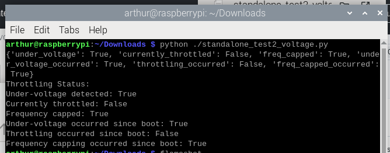
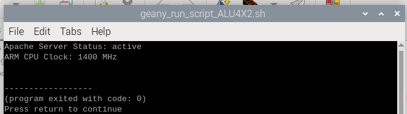

# Read voltage and clock info

## why read cpu clock?

The Apache server workload primarily involves handling network requests, parsing HTTP traffic, and delivering content. These tasks are CPU-intensive.

Monitoring the ARM CPU clock frequency helps understand whether the CPU is running at full capacity or is being throttled due to

- High temperature
- Power supply issues
- Resource contention

## !! No built-in power meter in RPIs

Starting with the Raspberry Pi 4, power monitoring has been slightly improved, but it still does not include a full power meter. The Pi 4 has enhanced voltage monitoring and thermal management but still lacks built-in current measurement or real-time power measurement capabilities.

### Reference

1. [raspberrypi document `vcgencmd`](https://github.com/raspberrypi/documentation/blob/0e2b6afed4dd6d7d0fa2560256c57cc2f2d08d3c/raspbian/applications/vcgencmd.md)

## 1. Test with command line

### voltage

Use the following command to get the RPI's throttling and power status.

```bash
vcgencmd get_throttled
```

It will return:

```bash
throttled=0x50005
```

Returns the throttled state of the system. This is a bit pattern.

| Bit | Meaning                             |
| :-: | ----------------------------------- |
|  0  | Under-voltage detected              |
|  1  | Arm frequency capped                |
|  2  | Currently throttled                 |
|  3  | Soft temperature limit active       |
| 16  | Under-voltage has occurred          |
| 17  | Arm frequency capped has occurred   |
| 18  | Throttling has occurred             |
| 19  | Soft temperature limit has occurred |

### cpu clock

Run

```sh
vcgencmd measure_clock arm
```

Output like:

```
frequency(48)=900002000
```

> Note the `vcgencmd measure_clock core` show the GPU and video core clock. If you're running Apache with graphical dashboards or other heavy animations, this is worth insights.

## Test with python code

Refer to the code [standalone test2 voltage](./standalone_test2_voltage.py) and code [standalone test3 clock](./standalone_test3_clock.py)
<br>
Run it and get the result as an dictionary.

The result look like this:

and this:


---
