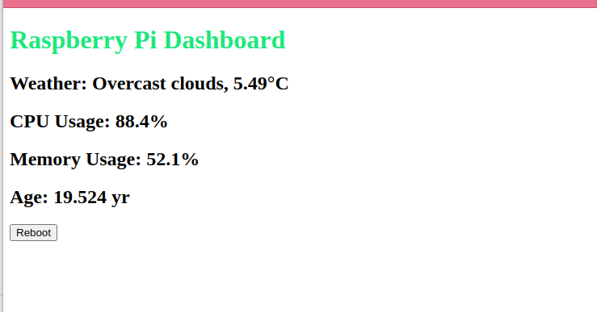

# How this `monitoring dashboard` works

## 1. Directory structure

> The '.css' and '.html' files have to go to the designated directory, according to `Flask`'s usage.

```
dashboard/
├── app.py                 # Main Flask application
├── static/
│   └── style.css          # CSS file
├── templates/
│   └── dashboard.html     # HTML template
├── config.json            # Configuration file
└── requirements.txt       # Python dependencies

```

## Running outcome:


