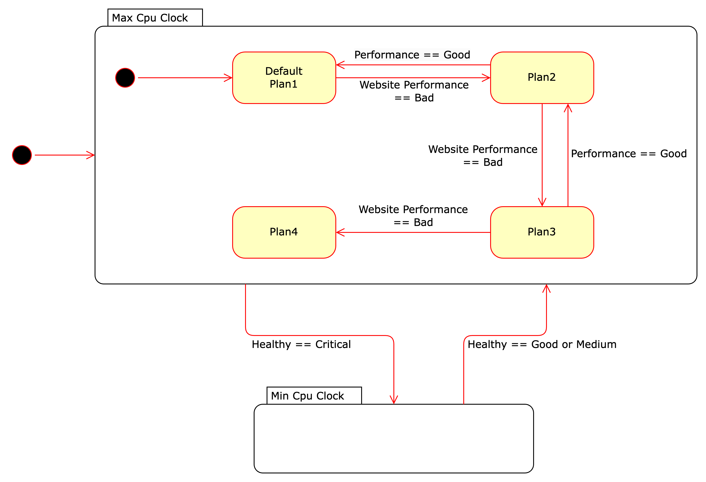

# Main Adaptation Idea (MAKE-K)

    # collect metrics: cpu, memory, cpu-temperature/  apache-load1, busyworkers(1~50), durationPerReq(ms)
    # calculate utilities
    # planning
    # executing

## 1. Collecting key data

1. Machine healthy
   1. cpu usage, 0~100%
   2. memory usage, 0~100%
   3. cpu temperature, 80c max, normally 50c
2. Website Performance
   1. apache-load1, 0~4,
   2. durationPerReq, ms
   3. busyworkers (1~50)

## 2. calculating utilities

Machine Healthy

1. =Good, if not bad
2. =Medium, cpu > 60% | memory > 60% | cpu_temperature > 60c
3. =Critical, cpu_temperature > 70c

Website Performance

1. =Good, if not bad
2. =Bad, load1>1 | DurationPerReq > 10ms | busyworkers > 30 |

## 3. planning the change

If Machine Healthy is 'Good', it's ok to set max clock
If Website Performace is 'Good', it's ok to set min clock

| Plan No. | Serve Content | Serve Visitors | Downtime                      | Clock |
| :------- | :------------ | :------------- | :---------------------------- | :---- |
| 1        | Full          | All            | No                            |
| 2        | Degraded      | All            | No                            |
| 3        | Degraded      | Limited Number | No                            |
| 4        | X             | X              | Shortest downtime (rebooting) |

Below is the state diagram.

## 4. executing the plan

1. set clock to min/max
2. degradation website
3. limite apache connecting number, rejecting extra requests
4. system reboot
